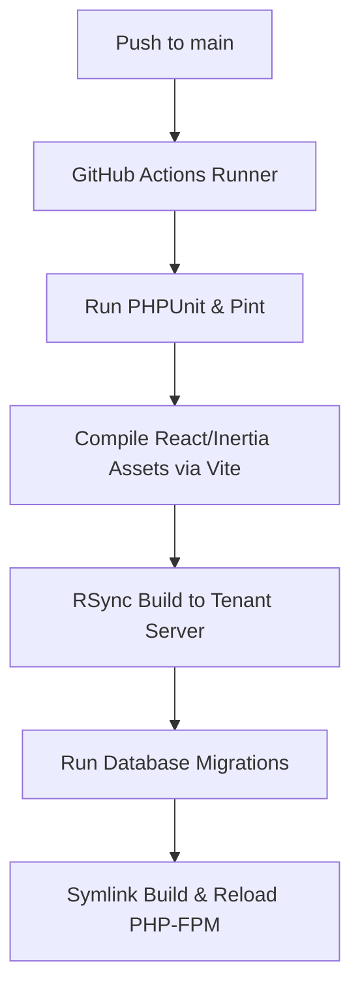

# Single-Tenant Hetzner Deployment Model Architecture

This document describes the architectural layout and deployment topology for **ParousiaAdsum** SaaS. To satisfy high data security, regulatory isolation, and low-latency geofenced verification, the application utilizes a **single-tenant dedicated VPS model** hosted on Hetzner Cloud.

---

## 1. Architectural Philosophy

While the codebase is maintained as a single monolithic repository (Laravel 13 + React Inertia), the runtime is isolated on a **per-client (tenant) basis**.

### Why Single-Tenant?

- **Data Isolation:** Each client gets a dedicated, isolated MySQL database on independent virtual hardware. There is zero risk of cross-tenant data leaks.
- **Dedicated Performance:** Resource-heavy attendance checks (GPS calculations, rotating dynamic QR codes, SMS verification webhooks) do not suffer from the "noisy neighbor" problem.
- **Regulatory Compliance:** Complies with strict data residency laws, enabling tenants to choose specific Hetzner datacenter regions (Falkenstein DE, Helsinki FI, Ashburn US, or Hillsboro US).
- **Custom Update Cycle:** Clients can choose to lock versions or defer non-critical software updates according to their internal schedules.

---

## 2. Infrastructure Specification (Hetzner Cloud)

For standard tenants, we deploy on Hetzner Cloud CX-series or CPX-series AMD EPYC virtual servers.

| Component           | Standard Tenant Spec               | Enterprise Tenant Spec             |
| :------------------ | :--------------------------------- | :--------------------------------- |
| **Server Instance** | Hetzner **CPX21** (shared vCPU)    | Hetzner **CCX21** (dedicated vCPU) |
| **CPU**             | 3 vCPUs (AMD EPYC)                 | 4 vCPUs (AMD EPYC)                 |
| **RAM**             | 4 GB RAM                           | 8 GB RAM                           |
| **Disk**            | 80 GB NVMe SSD                     | 160 GB NVMe SSD                    |
| **Traffic**         | 20 TB / Month                      | 20 TB / Month                      |
| **Location**        | Falkenstein (DE) or Hillsboro (US) | Choice of any Hetzner Datacenter   |

---

## 3. Technology Stack Topology

Every server runs a normalized, locked, and highly optimized server stack.

```
       [ Client Browser / Kiosk ]
                   │
                   ▼ (HTTPS - Port 443)
             [ Cloudflare WAF ]
                   │
                   ▼ (Strict SSL)
             [ Nginx Web Server ]
         ┌─────────┴─────────┐
         ▼                   ▼
    [ Static Assets ]     [ PHP-FPM 8.3/8.4 ]
   (Vite/React Build)        (Laravel 13 Monolith)
                             ├── [ Redis ] (Cache, Rate Limiting, Queues)
                             └── [ MySQL 8 ] (Isolated Database)
```

### Components

1. **Operating System:** Ubuntu 24.04 LTS (minimal, hardened).
2. **Reverse Proxy & Web Server:** Nginx 1.26+ with HTTP/2 enabled, configured with strict SSL/TLS parameters (TLS 1.3 only).
3. **Application Server:** PHP-FPM 8.3/8.4 running with OPcache and JIT enabled for high-performance request handling.
4. **Database Engine:** MySQL 8.0/8.4 configured with optimized InnoDB buffer pool size tailored to server memory (e.g., 50-60% of available RAM).
5. **In-Memory Store:** Redis (isolated instances for standard cache, rate-limiting geofence checks, and database-backed Horizon queues).

---

## 4. Security & Hardening

Security is paramount for attendance and verification tracking.

- **Firewall (UFW):** Only ports `80` (redirected to `443`), `443` (HTTPS), and `22` (custom SSH, rate-limited and restricted to VPN/deploy IP keys) are open.
- **Fail2Ban:** Active jail policies protect against SSH brute-forcing and rapid Nginx HTTP request hammering.
- **Database Network Isolation:** MySQL binds strictly to `127.0.0.1` and is completely inaccessible from the public internet.
- **SSL Certificates:** Automatically provisioned and renewed using Let's Encrypt via `certbot` or Laravel Forge integration.
- **Geofence Check Safeguards:** IP address rate-limiting implemented via Redis at the Nginx and Laravel middleware layers.

---

## 5. Provisioning & Deployment Workflow

We leverage standard infrastructure-as-code and modern deployment integrations to automate provisioning.

### Provisioning (Server Setup)

- Managed either via **Ansible Playbooks** or integrated with **Laravel Forge API**.
- Standardized shell scripts perform hardening, install dependencies, configure Nginx virtual hosts, set up let'sencrypt, and initialize Redis/MySQL.

### Zero-Downtime Deployment

Deployments are managed via GitHub Actions triggered on tags or main branch pushes to designated tenant targets.



1. **Build Step:** Static assets (Inertia React frontend) are built and compiled on the CI runner to conserve VPS resources.
2. **Release Step:** The runner SSHs into the VPS and clones the release code to a new timestamped release folder.
3. **Symlink Swap:** Once migrations succeed, standard symlink swapping points the Nginx document root to the new release, resulting in **zero downtime**.
4. **Daemon Reload:** PHP-FPM and Laravel Horizon queue workers are restarted gracefully.

---

## 6. Backups and Disaster Recovery

- **Database Backups:** Daily logical backups generated via `mysqldump` or Laravel Backup, encrypted, and streamed to an off-site **Hetzner Storage Box** or **S3-compatible bucket** with a 30-day retention policy.
- **File Backups:** Uploaded signatures, avatars, or attendance logs are stored on secure local block volumes, backed up nightly.
- **Point-In-Time recovery (PITR):** Available through Hetzner Cloud Snapshot schedule (daily backup of the full VPS disk).
